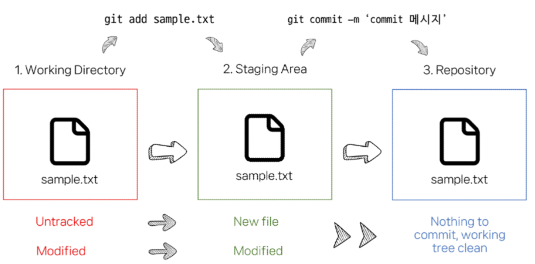

# GIT

[gitlab](https://lab.ssafy.com)

[github](https://www.github.com)


 ### git의 3가지 영역
- Working Directory
- Staging Area
- Repository



---
## git 동작

```
git init
```
**로컬 저장소 설정 (초기화)**

*git이 설정되어있는지 확인하는 방법*

  *1. '파일 탐색기에 표시'를 들어가서 .git 파일이 있는지 확인*

  *2. 터미널 맨 오른쪽에 (master) 확인*


```
git add
```
**변경사항이 있는 파일을 staging area에 추가**

*git add . -> 모든 파일을 staging area에 추가*

*vscode 소스제어 탭에서 +를 눌러 가능*

```
git commit -m 'commit 메시지'
```
**commit 생성하기**

*commit을 생성하기 위해서는 작성자 정보가 필요*
- git config --global user.email "메일주소"
- git config --global user.name "유저네임"

*소스제어 탭에서 커밋을 눌러 가능 (commit 메시지 꼭 작성할 것)*

```
git log
```
**commit 목록 확인**

```
git remote add origin url
```
**로컬 저장소에 원격 저장소 주소 추가**

*origin = 추가하는 원격 저장소 별칭*

```
git remote -v
```
**추가된 원격 저장소 목록 확인**

```
git push origin master
```
**원격 저장소에 commit 목록을 업로드**

*origin = 원격 저장소 이름*

*master = 브랜치*

```
git pull origin master
```
**원격 저장소의 변경사항만을 받아옴 (업데이트)**

```
git clone remote url
```
**원격 저장소 전체를 복제 (다운로드)**

```
gitignore
```
**git에서 특정 파일이나 디렉토리를 추적하지 않도록 설정하는 데 사용되는 텍스트파일**

*[gitignore 목록을 만들어주는 사이트](https://www.toptal.com/developers/gitignore/)*
